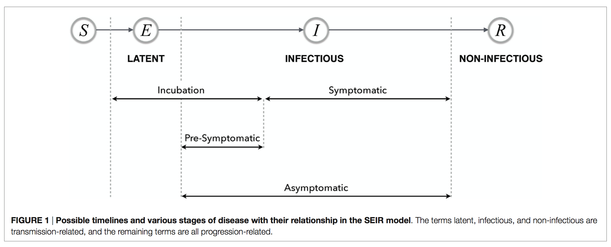

Resources for Influenza Research
================

  - [Topics and Keywords](#topics-and-keywords)
  - [Infectious Disease Epidemiology](#infectious-disease-epidemiology)
  - [Modeling Infectious Diseases](#modeling-infectious-diseases)
  - [Ecology and Evolution of
    Influenza](#ecology-and-evolution-of-influenza)
  - [Seasonality of Influenza](#seasonality-of-influenza)
  - [Dynamics of Influenza](#dynamics-of-influenza)
      - [Influenza Transmission](#influenza-transmission)
      - [Influenza Forecasting](#influenza-forecasting)
      - [Surveillance of Influenza](#surveillance-of-influenza)
      - [Digital Detection of
        Influenza](#digital-detection-of-influenza)
  - [Databases for Influenza
    Research](#databases-for-influenza-research)
  - [Software Packages for Influenza
    Research](#software-packages-for-influenza-research)
  - [Workshops and Conferences](#workshops-and-conferences)
  - [Courses](#courses)
  - [Channels](#channels)
  - [Glossary](#glossary)
  - [Films and TV Series](#films-and-tv-series)
  - [Contributing](#contributing)
  - [References](#references)

## Topics and Keywords

  - [Influenza](http://en.wikipedia.org/wiki/Influenza) | Flu
  - Pandemic (Antigenic Shift) vs. Epidemic (Antigenic Drift)
  - Epidemiology of Influenza
  - Modeling Influenza
      - Transmission
      - Forecasting
  - Surveillence of Influenza
  - Ecology of Influenza
  - Evolution of Influenza
      - [Phylodynamics](https://en.wikipedia.org/wiki/Viral_phylodynamics)
      - [Phylogeography](http://en.wikipedia.org/wiki/Phylogeography)

## Infectious Disease Epidemiology

*Textbooks*

  - Gordis, L. (2013).
    [Epidemiology](http://www.amazon.com/Epidemiology-STUDENT-CONSULT-Online-Access/dp/145573733X).
    Elsevier: Saunders.
      - [ ] Chapter 2 The Dynamics of Disease Transmission
  - Nelson, K. E., & Williams, C. (2013). [Infectious disease
    epidemiology](https://www.amazon.com/Infectious-Disease-Epidemiology-Theory-Practice/dp/1449683797).
    Jones & Bartlett Publishers.
      - [x] Chapter 6 Infectious Disease Dynamics
      - [ ] Chapter 7 Geographic Information Systems
      - [x] Chapter 15 Epidemiology and Prevention of Influenza

## Modeling Infectious Diseases

*Textbooks*

  - Anderson, R. M., & May, R. M. (1991). [Infectious Diseases of
    Humans: Dynamics and
    Control](http://www.amazon.com/Infectious-Diseases-Humans-Dynamics-Publications/dp/019854040X).
    Oxford: Oxford university press.
  - Keeling, M. J., & Rohani, P. (2008). [Modeling Infectious Diseases
    in Humans and
    Animals](http://www.amazon.com/Modeling-Infectious-Diseases-Humans-Animals/dp/0691116172/).
    Princeton University Press.
      - Book website:
        [www.modelinginfectiousdiseases.org](http://www.modelinginfectiousdiseases.org/)
  - Diekmann, O., Heesterbeek, H., & Britton, T. (2012). [Mathematical
    tools for understanding infectious disease
    dynamics](https://www.amazon.com/Mathematical-Understanding-Infectious-Disease-Dynamics/dp/0691155399/).
    Princeton University Press.
  - Diekmann, O., & Heesterbeek, J. A. P. (2000). [Mathematical
    epidemiology of infectious diseases: model building, analysis and
    interpretation](https://www.amazon.com/Mathematical-Epidemiology-Infectious-Diseases-Interpretation/dp/0471986828).
    John Wiley & Sons.
  - Sattenspiel, L. (2009). [The Geographic Spread of Infectious
    Diseases: Models and
    Applications](http://www.amazon.com/Geographic-Spread-Infectious-Diseases-Computational/dp/069112132X/).
    Princeton University Press.
  - [x] Vynnycky, E., & White, R. (2010). [An Introduction to Infectious
    Disease
    Modelling](https://www.amazon.com/Introduction-Infectious-Disease-Modelling/dp/0198565763).
    Oxford University Press.
      - Book website:
        [www.anintroductiontoinfectiousdiseasemodelling.com](http://www.anintroductiontoinfectiousdiseasemodelling.com/)
  - Bjørnstad, Ottar N. (2018). [Epidemics: Models and Data Using
    R](https://www.amazon.com/Epidemics-Models-Data-Using-R/dp/3319974866).
    Springer International Publishing.
  - Fine, P. (1981). [Influenza Models: Prospects for Development and
    Use](http://www.springer.com/gp/book/9789401180528). Proceedings of
    a Working Group on Epidemiological Models of Influenza and Their
    Practical Application.

*Review Papers*

  - Metcalf, C. J. E., & Lessler, J. (2017). [Opportunities and
    challenges in modeling emerging infectious
    diseases](http://science.sciencemag.org/content/357/6347/149).
    Science, 357(6347), 149-152.
  - [x] Heesterbeek, H., Anderson, R. M., Andreasen, V., Bansal, S., De
    Angelis, D., Dye, C., … & Viboud, C. (2015). [Modeling Infectious
    Disease Dynamics in the Complex Landscape of Global
    Health](http://www.sciencemag.org/content/347/6227/aaa4339.short).
    Science, 347(6227), aaa4339.
  - A Special Issue of *Epidemics* on [Challenges in Modelling
    Infectious Disease
    Dynamics](http://www.sciencedirect.com/science/journal/17554365/10).
  - [x] Grassly, N. C., & Fraser, C. (2008). [Mathematical Models of
    Infectious Disease
    Transmission](http://www.nature.com/nrmicro/journal/v6/n6/full/nrmicro1845.html).
    Nature Reviews Microbiology, 6(6), 477-487.
  - McCallum, H., Barlow, N., & Hone, J. (2001). [How should pathogen
    transmission be
    modelled?](https://www.sciencedirect.com/science/article/pii/S0169534701021449).
    Trends in ecology & evolution, 16(6), 295-300.
  - Hethcote, H. W. (2000). [The Mathematics of Infectious
    Diseases](http://epubs.siam.org/doi/abs/10.1137/S0036144500371907).
    SIAM review, 42(4), 599-653.

## Ecology and Evolution of Influenza

*Textbook*

  - Webster, R. G., Monto, A. S., Braciale, T. J., & Lamb, R. A. (2014).
    [Textbook of
    Influenza](http://www.amazon.com/Textbook-Influenza-Robert-G-Webster/dp/0470670487/).
    John Wiley & Sons.

*Review Papers*

  - Nelson, M. I., & Holmes, E. C. (2007). [The Evolution of Epidemic
    Influenza](http://www.nature.com/nrg/journal/v8/n3/abs/nrg2053.html).
    Nature reviews genetics, 8(3), 196-205.
  - [x] Earn, D. J., Dushoff, J., & Levin, S. A. (2002). [Ecology and
    Evolution of the
    Flu](http://www.sciencedirect.com/science/article/pii/S0169534702025028).
    Trends in ecology & evolution, 17(7), 334-340.
  - [x] Potter, C. W. (2001). [A History of
    Influenza](http://onlinelibrary.wiley.com/doi/10.1046/j.1365-2672.2001.01492.x/full).
    Journal of applied microbiology, 91(4), 572-579.
  - [x] Cox, N. J., & Subbarao, K. (2000). [Global Epidemiology of
    Influenza: Past and
    Present](http://www.annualreviews.org/doi/abs/10.1146/annurev.med.51.1.407).
    Annual review of medicine, 51(1), 407-421.
  - Webster, R. G., Bean, W. J., Gorman, O. T., Chambers, T. M., &
    Kawaoka, Y. (1992). [Evolution and Ecology of Influenza A
    Viruses](http://mmbr.asm.org/content/56/1/152.short).
    Microbiological reviews, 56(1), 152-179.

## Seasonality of Influenza

*Key Paper*

  - [x] Dushoff, J., Plotkin, J. B., Levin, S. A., & Earn, D. J. (2004).
    [Dynamical resonance can account for seasonality of influenza
    epidemics](http://www.pnas.org/content/101/48/16915.short).
    Proceedings of the National Academy of Sciences of the United States
    of America, 101(48), 16915-16916.
  - [x] Shaman, J., & Kohn, M. (2009). [Absolute humidity modulates
    influenza survival, transmission, and
    seasonality](http://www.pnas.org/content/106/9/3243.short).
    Proceedings of the National Academy of Sciences, 106(9), 3243-3248.
  - [x] Deyle, E. R., Maher, M. C., Hernandez, R. D., Basu, S., &
    Sugihara, G. (2016). [Global environmental drivers of
    influenza](http://www.pnas.org/content/113/46/13081.abstract).
    Proceedings of the National Academy of Sciences, 201607747.
  - Metcalf, C. J. E., Walter, K. S., Wesolowski, A., Buckee, C. O.,
    Shevliakova, E., Tatem, A. J., … & Pitzer, V. E. (2017).
    [Identifying climate drivers of infectious disease dynamics: recent
    advances and challenges
    ahead](https://royalsocietypublishing.org/doi/full/10.1098/rspb.2017.0901).
    Proceedings of the Royal Society B: Biological Sciences, 284(1860),
    20170901.

*Review Papers*

  - Altizer, S., Dobson, A., Hosseini, P., Hudson, P., Pascual, M., &
    Rohani, P. (2006). [Seasonality and the dynamics of infectious
    diseases](http://onlinelibrary.wiley.com/doi/10.1111/j.1461-0248.2005.00879.x/full).
    Ecology letters, 9(4), 467-484.
  - Grassly, N. C., & Fraser, C. (2006). [Seasonal infectious disease
    epidemiology](http://rspb.royalsocietypublishing.org/content/273/1600/2541.short).
    Proceedings of the Royal Society of London B: Biological Sciences,
    273(1600), 2541-2550.
  - Fisman, D. N. (2007). [Seasonality of infectious
    diseases](http://www.annualreviews.org/doi/abs/10.1146/annurev.publhealth.28.021406.144128).
    Annu. Rev. Public Health, 28, 127-143.
  - Tamerius, J., Nelson, M. I., Zhou, S. Z., Viboud, C., Miller, M. A.,
    & Alonso, W. J. (2011). [Global influenza seasonality: reconciling
    patterns across temperate and tropical
    regions](http://ehp.niehs.nih.gov/1002383/). Environmental health
    perspectives, 119(4), 439.
  - [x] Fuhrmann, C. (2010). [The Effects of Weather and Climate on the
    Seasonality of Influenza: What We Know and What We Need to
    Know](http://onlinelibrary.wiley.com/doi/10.1111/j.1749-8198.2010.00343.x/full).
    Geography Compass, 4(7), 718-730.
  - [x] Lipsitch, M., & Viboud, C. (2009). [Influenza Seasonality:
    Lifting the Fog](http://www.pnas.org/content/106/10/3645.short).
    Proceedings of the National Academy of Sciences, 106(10), 3645-3646.
  - Lofgren, E., Fefferman, N. H., Naumov, Y. N., Gorski, J., & Naumova,
    E. N. (2007). [Influenza Seasonality: Underlying Causes and Modeling
    Theories](http://jvi.asm.org/content/81/11/5429.short). Journal of
    virology, 81(11), 5429-5436.

## Dynamics of Influenza

### Influenza Transmission

*Classical Paper*

  - [x] Rvachev, L. A., & Longini, I. M. (1985). [A Mathematical Model
    for the Global Spread of
    Influenza](http://www.sciencedirect.com/science/article/pii/0025556485900641).
    Mathematical biosciences, 75(1), 3-22.

### Influenza Forecasting

*Review Papers*

  - Nsoesie, E. O., Brownstein, J. S., Ramakrishnan, N., & Marathe, M.
    V. (2014). [A Systematic Review of Studies on Forecasting the
    Dynamics of Influenza
    Outbreaks](http://onlinelibrary.wiley.com/doi/10.1111/irv.12226/full).
    Influenza and other respiratory viruses, 8(3), 309-316.
  - [x] Chretien, J. P., George, D., Shaman, J., Chitale, R. A., &
    McKenzie, F. E. (2014). [Influenza Forecasting in Human Populations:
    a Scoping
    Review](http://journals.plos.org/plosone/article?id=10.1371/journal.pone.0094130).
    PloS one, 9(4), e94130.

*Projects*

  - [FluSight 2016-17](https://predict.phiresearchlab.org/post/57f3f440123b0f563ece2576)
    from [Epidemic Prediction
    Initiative](https://predict.phiresearchlab.org/)
      - [flusight](http://reichlab.io/flusight/): a static influenza
        forecasts visualizer created by the
        [Reich](https://github.com/nickreich) Lab at UMass-Amherst.
        [source code](https://github.com/reichlab/flusight)
  - The [Delphi](http://delphi.midas.cs.cmu.edu/) group at Carnegie
    Mellon University focuses on developing the theory and practice of
    epidemiological forecasting.
      - [ILI-Nearby](http://delphi.midas.cs.cmu.edu/nowcast/):
        Geographically detailed real-time estimates (nowcasts) of
        Influenza-Like-Illness.
      - [Delphi’s forecasts](http://delphi.midas.cs.cmu.edu/forecast/):
        Weekly forecasts of Influenza-Like-Illness nationally and in 10
        U.S. regions.

### Surveillance of Influenza

*Review Paper*

  - [x] Unkel, S., Farrington, C., Garthwaite, P. H., Robertson, C., &
    Andrews, N. (2012). [Statistical methods for the prospective
    detection of infectious disease outbreaks: a
    review](https://rss.onlinelibrary.wiley.com/doi/abs/10.1111/j.1467-985X.2011.00714.x).
    Journal of the Royal Statistical Society: Series A (Statistics in
    Society), 175(1), 49-82.

### Digital Detection of Influenza

*Review Paper*

  - Salathe, M., Bengtsson, L., Bodnar, T. J., Brewer, D. D.,
    Brownstein, J. S., Buckee, C., … & Vespignani, A. (2012). [Digital
    Epidemiology](http://journals.plos.org/ploscompbiol/article?id=10.1371/journal.pcbi.1002616).
    PLoS computational biology, 8(7), e1002616.

*Classical Paper*

  - [x] Ginsberg, J., Mohebbi, M. H., Patel, R. S., Brammer, L.,
    Smolinski, M. S., & Brilliant, L. (2009). [Detecting Influenza
    Epidemics using Search Engine Query
    Data](http://www.nature.com/nature/journal/v457/n7232/abs/nature07634.html).
    Nature, 457(7232), 1012-1014.

*Projects*

  - [Google Flu Trends](https://www.google.org/flutrends/intl/en_us/):
    using aggregated Google search data to estimate flu activity.
  - [HealthMap](http://www.healthmap.org/en/): flu & Ebola map | virus &
    contagious disease surveillence.

## Databases for Influenza Research

  - [WHO
    FluNet](http://www.who.int/influenza/gisrs_laboratory/flunet/en/): a
    global tool for influenza virological surveillance.
  - [WHO
    FluID](http://www.who.int/influenza/surveillance_monitoring/fluid/en/):
    a data collection tool to collect defined epidemiological indicators
    and data on seasonal and pandemic Influenza from national, regional
    and global systems on a weekly basis. It complements the existing
    virological data collection tool FluNet.
  - [Weekly U.S. Influenza Surveillance
    Report](http://www.cdc.gov/flu/weekly/)
      - [FluView](http://gis.cdc.gov/grasp/fluview/main.html):
        influenza-like illness (ILI) activity level indicator determined
        by data reported to ILINet.
      - [FluView](http://gis.cdc.gov/grasp/fluview/fluportaldashboard.html):
        national and regional level outpatient illness and viral
        surveillence.
      - [FluView](https://gis.cdc.gov/grasp/fluview/flu_by_age_virus.html):
        age group distribution of influenza positive specimens reported
        by public health laboratories.
      - [FluView](https://gis.cdc.gov/grasp/fluview/mortality.html):
        pneumonia and influenza (P\&I) mortality surveillance from the
        National Center for Health Statistics (NCHS) mortality
        surveillance system.
      - [FluView](https://gis.cdc.gov/GRASP/Fluview/PedFluDeath.html):
        influenza-associated pediatric mortality.
      - FluView: laboratory-confirmed influenza hospitalizations
        [preliminary cumulative
        rates](https://gis.cdc.gov/GRASP/Fluview/PedFluDeath.html) and
        [preliminary
        data](https://gis.cdc.gov/grasp/fluview/FluHospChars.html).
      - The R package
        [cdcfluview](https://cran.r-project.org/web/packages/cdcfluview/index.html)
        can retrieve the U.S. flu season data from the CDC FluView
        portal.
      - [delphi-epidata](https://github.com/cmu-delphi/delphi-epidata):
        DELPHI’s real-time epidemiological data API, which currently
        contains influenza and dengue data for the United States and
        Taiwan.
  - Weekly influenza reports from [Chinese National Influenza
    Center](http://www.chinaivdc.cn/lgzx/zyzx/lgzb/)
  - Estimated flu activity from [Google Flu
    Trends](https://www.google.org/flutrends/intl/en_us/). Google is no
    longer publishing estimates of disease activity (as of August 20,
    2015), but it continue to provide signal data for research purposes.
    See details on [the next chapter for Google Flu
    Trends](https://research.googleblog.com/2015/08/the-next-chapter-for-flu-trends.html)
    (Ginsberg et al., [2009](#ref-Ginsberg-etal:2009); Butler,
    [2013](#ref-Butler:2013); Lazer et al.,
    [2014](#ref-Lazer-etal:2014)).
  - [HealthMap Flu Trends](http://www.healthmap.org/flutrends/) (see
    Freifeld et al., [2008](#ref-Freifeld-etal:2008) for details)
  - [FluWeb Historical Influenza
    Database](http://influenza.sph.unimelb.edu.au/): free access to a
    number of rare and valuable sources of data concerning past
    influenza outbreaks.
  - [Project Tycho®](http://www.tycho.pitt.edu/): currently including
    data from all weekly notifiable disease (containing **influenza**
    and **pneumonia**) reports for the United States dating back to 1888
    (see Panhuis et al., [2013](#ref-Panhuis-etal:2013) for details).
  - [Influenza Research Database (IRD)](http://www.fludb.org/): global
    public database and analysis resource for the study of influenza
    viruses (see Squires et al., [2012](#ref-Squires-etal:2012) for
    details).
  - [NCBI Influenza Virus
    Resource](http://www.ncbi.nlm.nih.gov/genomes/FLU/)
  - [Global Initiative on Sharing Avian Influenza Data
    (GISAID)](http://platform.gisaid.org/)
  - [EMPRES Global Animal Disease Information System
    (EMPRES-i)](http://empres-i.fao.org/eipws3g/)
  - [1918-1919 Influenza Pandemic Mortality in England and
    Wales](https://beta.ukdataservice.ac.uk/datacatalogue/studies/study?id=4350):
    this dataset can be used for reproducing results from several
    studies that investigated the spatio-temporal spread of 1918-1919
    influenza pandemic in England and Wales.
  - [Social Contact Data](http://www.socialcontactdata.org/): a website
    for sharing social contact data and data analysis methods between
    researchers in infectious diseases modelling.

## Software Packages for Influenza Research

*R Packages*

  - [cdcfluview](https://cran.r-project.org/web/packages/cdcfluview/index.html):
    Retrieve U.S. Flu Season Data from the CDC FluView Portal.
  - [coarseDataTools](https://CRAN.R-project.org/package=coarseDataTools):
    Analysis of Coarsely Observed Data.
  - [EpiDynamics](https://cran.r-project.org/web/packages/EpiDynamics/index.html):
    Dynamic Models in Epidemiology. Currently, the R package
    **EpiDynamics** implements the computer programs written in other
    programming languages and available in [the web page of the
    book](http://www.modelinginfectiousdiseases.org/) written by Keeling
    & Rohani ([2008](#ref-Keeling-Rohani:2008)). Python Programs for
    this book can also be found
    [here](http://wiki.deductivethinking.com/wiki/Python_Programs_for_Modelling_Infectious_Diseases_book).
  - [epidemics](https://github.com/ensoesie/epidemics): An R package to
    define seasonal influenza epidemic onset and duration.
  - [epimdr](https://cran.r-project.org/web/packages/epimdr/index.html):
    Functions and Data for “Epidemics: Models and Data in R”.
  - [EpiModel](https://cran.r-project.org/web/packages/EpiModel/index.html):
    Mathematical Modeling of Infectious Disease.
  - [epitools](https://cran.r-project.org/web/packages/epitools/index.html):
    Tools for training and practicing epidemiologists including methods
    for two-way and multi-way contingency tables.
  - [epinet](https://cran.r-project.org/web/packages/epinet/index.html):
    An R package to analyze epidemics spread across contact networks.
    Details are described in Groendyke & Welch
    ([2018](#ref-Groendyke-Welch:2018)).
  - [fitR](https://cran.r-project.org/web/packages/mem/): Provides
    functions for model fitting and inference.
  - [mem](https://cran.r-project.org/web/packages/mem/index.html): The
    Moving Epidemic Method, created by Tomás Vega and José E. Lozano
    (see details in Vega et al. ([2013](#ref-Vega-etal:2013)) and Vega
    et al. ([2015](#ref-Vega-etal:2015))), allows the weekly assessment
    of the epidemic and intensity status to help in routine respiratory
    infections surveillance in health systems.
  - [R0](https://cran.r-project.org/web/packages/R0/index.html):
    Estimation of R0 and Real-Time Reproduction Number from Epidemics.
    Details are described in Obadia et al.
    ([2012](#ref-Obadia-etal:2012)).
  - [socialmixr](https://cran.r-project.org/web/packages/socialmixr/index.html):
    Provides methods for sampling contact matrices from diary data for
    use in infectious disease modelling, as discussed in Mossong et al.
    ([2008](#ref-Mossong-etal:2008)).
  - [tsiR](https://cran.r-project.org/web/packages/tsiR/index.html): An
    implementation of the time-series Susceptible-Infected-Recovered
    (TSIR) model described by Finkenstädt & Grenfell
    ([2000](#ref-Finkenstaedt-Grenfell:2000)) using a number of
    different fitting options for infectious disease time series data.
  - [tycho2](https://github.com/allopole/tycho2): R interface to
    [Project Tycho 2.0 API](https://www.tycho.pitt.edu/dataset/api/).
  - [Projects](http://www.repidemicsconsortium.org/projects/) of [R
    Epidemics Consortium (RECON)](http://www.repidemicsconsortium.org/):
    lists released projects and packages, up-and-coming packages, and
    related packages that authored by RECON members and relevant for
    infectious disease epidemiology. The precursor of RECON is [The
    R-epi project](https://sites.google.com/site/therepiproject/home),
    which will eventually be replaced by the RECON website.

*Python Packages*

  - [pypfilt](http://pypfilt.readthedocs.io/en/latest/): Bootstrap
    particle filter for epidemic forecasting.
  - [epifx](http://epifx.readthedocs.io/en/latest/): Epidemic
    forecasting with mechanistic infection models.

## Workshops and Conferences

  - [x] [Multinational Influenza Seasonal Mortality Study (MISMS)
    Workshop](http://www.origem.info/misms/)
  - [Options for the Control of Influenza
    Conference](https://www.isirv.org/site/)
  - [x] [International Conference on Emerging Infectious
    Diseases](https://www.cdc.gov/iceid/index.html)
  - [International Meeting on Emerging Diseases and
    Surveillance](http://imed.isid.org/)
  - [Epidemics: International Conference on Infectious Disease
    Dynamics](https://www.elsevier.com/events/conferences/international-conference-on-infectious-disease-dynamics)
  - [Annual Ecology and Evolution of Infectious Disease
    Conference](http://eeidconference.org/)
  - [IDDconf: A Conference on Infectious Disease
    Dynamics](http://iddconf.org/)

## Courses

*Massive Open Online Courses (MOOCs)*

  - [Epidemics - the Dynamics of Infectious
    Diseases](https://www.coursera.org/course/epidemics): a course
    provided by the Pennsylvania State University discusses about the
    dynamics of Malaria, HIV/AIDS, Influenza, Measles - how they emerge,
    how they spread around the globe, and how they can best be
    controlled. The R package
    [epimdr](https://cran.r-project.org/web/packages/epimdr/index.html)
    is an advanced quantitative companion to this course.

  - [Epidemics](https://www.edx.org/course/epidemics-hkux-hku01x-0): a
    course provided by the University of Hong Kong covers these four
    topics: origins of novel pathogens; analysis of the spread of
    infectious diseases; medical and public health countermeasures to
    prevent and control epidemics; panel discussions involving leading
    public health experts with deep frontline experiences to share their
    views on risk communication, crisis management, ethics and public
    trust in the context of infectious disease control.

*Short courses*

  - [Introduction to Mathematical Models of the Epidemiology & Control
    of Infectious Diseases](http://www.infectiousdiseasemodels.org/): an
    interactive short course taught by leading researchers who advise
    policy-makers internationally. Topics include HIV, TB, malaria,
    Ebola, pandemic influenza, health economics, vaccination programmes,
    stochastic models & more.

  - [Introduction to Infectious Disease Modelling and Its
    Applications](https://www.lshtm.ac.uk/study/courses/short-courses/infectious-disease-modelling):
    a two week course organised jointly between the [London School of
    Hygiene & Tropical Medicine (LSHTM)](https://www.lshtm.ac.uk/) and
    [Public Health
    England](https://www.gov.uk/government/organisations/public-health-england).

  - [x] [Model Fitting and Inference for Infectious Disease Dynamics
    (MFIIDD)](https://www.lshtm.ac.uk/study/courses/short-courses/infectious-diseases-dynamics):
    a short course taught by members of the [Centre for the Mathematical
    Modelling of Infectious Diseases (CMMID)](http://cmmid.lshtm.ac.uk/)
    at the [London School of Hygiene & Tropical Medicine
    (LSHTM)](https://www.lshtm.ac.uk/). MFIIDD 2016 course materials can
    be found [here](http://sbfnk.github.io/mfiidd/index.html).

  - [Model-based Inference in Ecology and
    Epidemiology](http://kingaa.github.io/short-course/): an
    introduction to ecological and epidemiological stochastic dynamical
    systems models using a series of examples with real data.

  - [Network Modeling for Epidemics](http://statnet.github.io/nme/): a
    5-day short course at the University of Washington that provides an
    introduction to stochastic network models for infectious disease
    transmission dynamics, with a focus on empirically based modeling of
    HIV transmission.

*Summer School*

  - [x] [Computational Biology for Infectious Diseases
    (CBID)](http://cbid.asia/): The summer school is for students,
    researchers and professionals working on infectious diseases and
    wishing to acquire knowledge and practice in quantitative analyses
    or, on the contrary, working in modeling sciences (mathematics,
    informatics) and wishing to acquire knowledge in health sciences
    applications.

  - [Summer Institute in Statistics and Modeling in Infectious Diseases
    (SISMID)](https://www.biostat.washington.edu/suminst/sismid): The
    summer institute is designed to introduce infectious disease
    researchers to modern methods of statistical analysis and
    mathematical modeling and to introduce statisticians and
    mathematical modelers to the statistical and dynamic problems posed
    by modern infectious disease data.
    
      - [Materials](http://faculty.washington.edu/kenrice/rintro/index.shtml)
        for [SISMID 2016 Module 4: Introduction to
        R](https://www.biostat.washington.edu/suminst/sismid2016/modules/MD1604)
      - Lectures
        [1](https://www.biostat.washington.edu/sites/default/files/modules//2016_SISMID_05_1.pdf),
        [2](https://www.biostat.washington.edu/sites/default/files/modules//2016_SISMID_05_2.pdf),
        [3](https://www.biostat.washington.edu/sites/default/files/modules//2016_SISMID_05_3.pdf),
        [4](https://www.biostat.washington.edu/sites/default/files/modules//2016_SISMID_05_4.pdf),
        [5](https://www.biostat.washington.edu/sites/default/files/modules//2016_SISMID_05_5.pdf),
        [6](http://www.cidid.org/s/SISMID2016_Module_5_Lecture_6.pptx),
        [7](https://www.biostat.washington.edu/sites/default/files/modules//2016_SISMID_05_7.pdf),
        [8](https://www.biostat.washington.edu/sites/default/files/modules//2016_SISMID_05_8.pdf),
        [9](https://www.biostat.washington.edu/sites/default/files/modules//2016_SISMID_05_9.pdf),
        [10](https://www.biostat.washington.edu/sites/default/files/modules//2016_SISMID_05_10.pdf)
        for [SISMID 2016 Module 5: Stochastic Epidemic Models with
        Inference](https://www.biostat.washington.edu/suminst/sismid2016/modules/MD1605)
      - [Materials](http://vnminin.github.io/SISMID_MCMC_I/) for
        [SISMID 2016 Module 7: MCMC I for Infectious
        Diseases](https://www.biostat.washington.edu/suminst/sismid2016/modules/MD1607)
      - [Materials](http://kingaa.github.io/sbied/) for [SISMID 2016
        Module 9: Simulation-based Inference for Epidemiological
        Dynamics](https://www.biostat.washington.edu/suminst/sismid2016/modules/MD1609)
      - [Materials](https://github.com/chendaniely/2016-07-sismid/tree/master/sismid_10-statistics_and_modeling_with_novel_data_streams)
        for [SISMID 2016 Module 10: Statistics and Modeling with Novel
        Data
        Streams](https://www.biostat.washington.edu/suminst/sismid2016/modules/MD1610)
      - [Materials](https://github.com/chendaniely/2016-07-sismid/tree/master/sismid_11-mcmc2_for_infectious_diseases)
        for [SISMID 2016 Module 11: MCMC II for Infectious
        Diseases](https://www.biostat.washington.edu/suminst/sismid2016/modules/MD1611)
      - [Materials](http://bedford.io/projects/sismid/) for [SISMID 2016
        Module 15: Pathogen Evolution, Selection, and
        Immunity](https://www.biostat.washington.edu/suminst/sismid2016/modules/MD1615)
      - [Materials](https://github.com/chendaniely/2016-07-sismid/tree/master/sismid_16-spatial_statistics)
        for [SISMID 2016 Module 16: Spatial Statistics in Epidemiology
        and Public
        Health](https://www.biostat.washington.edu/suminst/sismid2016/modules/MD1616)

## Channels

  - [Disease Forecasting & Surveillance](https://channels.plos.org/dfs):
    a global forum for disease forecasting and surveillance research.
  - [RECON learn](https://www.reconlearn.org/): a free, open platform
    for training material on epidemics analysis.

## Glossary

*Review Papers*

  - Moghadas, S., & Laskowski, M. (2014). [Review of terms used in
    modelling influenza
    infection](http://nccid.ca/publications/review-of-terms-used-in-modelling-influenza-infection/).
    NCCID, 1-39.

  - Moghadas, S., & Laskowski, M. (2014). [A Logical Modelling Framework
    for Influenza
    Infection](http://nccid.ca/publications/a-logical-modelling-framework-for-influenza-infection/).
    NCCID, 1-24.

  - [x] Milwid, R., Steriu, A., Arino, J., Heffernan, J., Hyder, A.,
    Schanzer, D., … & Moghadas, S. M. (2016). [Toward Standardizing a
    Lexicon of Infectious Disease Modeling
    Terms](http://journal.frontiersin.org/article/10.3389/fpubh.2016.00213/full).
    Frontiers in Public Health, 4.

  - Moghadas, S., & Milwid, R. (2016). [Glossary of Terms for Infectious
    Disease Modelling: A Proposal for Consistent
    Language](http://nccid.ca/publications/glossary-terms-infectious-disease-modelling-proposal-consistent-language/).
    NCCID, 1-3.

  - [x] Mishra, S., Fisman, D. N., & Boily, M. C. (2010). [The ABC of
    terms used in mathematical models of infectious
    diseases](http://jech.bmj.com/content/early/2010/10/21/jech.2009.097113.short).
    Journal of epidemiology and community health, jech-2009.

*Terms*

  - **Index case**
      - Definition: The first case in a family or other defined group to
        come to the attention of the investigator (Porta,
        [2014](#ref-Porta:2014)).
      - Chinese: 指示病例
  - **Primary case**
      - Definition: The individual who introduces the disease into the
        family or group under study. Not necessarily the first diagnosed
        case in a family or group (Porta, [2014](#ref-Porta:2014)).
      - Chinese: 原发病例
  - **Secondary case**
      - Definition: TODO
      - Chinese: 二代病例，继发病例，续发病例
  - **Latent period**
      - Definition: The latent period refers to the period of time
        between exposure to a disease with successful transmission and
        the onset of **infectiousness** (Milwid et al.,
        [2016](#ref-Milwid-etal:2016)).
      - Chinese: 潜隐期
  - **Incubation period**
      - Definition: The incubation period is defined as the period of
        time between exposure to the disease (if transmission occurs)
        and the onset of **clinical symptoms** (Milwid et al.,
        [2016](#ref-Milwid-etal:2016)).
      - Chinese: 潜伏期
  - **Infectious period**
      - Definition: The infectious period is defined as the time
        interval in which the infected individual is capable of
        transmitting the disease (Milwid et al.,
        [2016](#ref-Milwid-etal:2016)).
      - Chinese: 感染期

The relationship of periods: latent, incubation, and infectious in the
SEIR model is illustrated in Figure 1 of Milwid et al.
([2016](#ref-Milwid-etal:2016)).

  - **Generation time (interval)**
      - Definition: In modeling, the generation interval refers to the
        period of time between the onset of **the infectious period** in
        a primary case to the onset of **the infectious period** in a
        secondary case infected by the primary case (Wallinga & Teunis,
        [2004](#ref-Wallinga-Teunis:2004); Milwid et al.,
        [2016](#ref-Milwid-etal:2016)).
      - Chinese: 世代时间
  - **Serial interval**
      - Definition: In epidemiology, the serial interval is defined as
        the period of time between the onset of **symptoms** in a
        primary case to the onset of **symptoms** in a secondary case
        infected by the primary case (Fine, [2003](#ref-Fine:2003);
        Milwid et al., [2016](#ref-Milwid-etal:2016)).
      - Chinese: 代际间隔
  - **Morbidity (rate)**
      - [Definition](https://www.health.ny.gov/diseases/chronic/basicstat.htm):
        Morbidity is another term for illness.
      - Chinese: 发病率
  - **Mortality (rate)**
      - [Definition](https://www.health.ny.gov/diseases/chronic/basicstat.htm):
        Mortality is another term for death.
      - Chinese: 死亡率
  - **Incidence**
      - Definition: Disease incidence is defined by both epidemiologists
        and modelers as the number of **new** cases in a population
        generated within a certain time period (Milwid et al.,
        [2016](#ref-Milwid-etal:2016)).
      - Chinese: 发病率
  - **Prevalence**
      - Definition: Disease prevalence is defined as the number of cases
        of a disease at a single time point in a population (Milwid et
        al., [2016](#ref-Milwid-etal:2016)).
      - Chinese: 患病率
  - **Attack rate**
      - Definition: The attack rate describes the proportion of the
        population that becomes **infected** over a specified period of
        time (Milwid et al., [2016](#ref-Milwid-etal:2016)).
      - Chinese: 罹患率
  - **Clinical attack rate**
      - Definition: The clinical attack rate measures the proportion fo
        the population that develops disease **symptoms** as a result of
        an infection (Milwid et al., [2016](#ref-Milwid-etal:2016)).
      - Chinese: 临床罹患率
  - **Secondary attack rate**
      - Definition: The secondary attack rate (SAR) is the probability
        that infection occurs among susceptible persons within a
        reasonable incubation period following known contact with an
        infectious person or another infectious source (Altman et al.,
        [2005](#ref-Altman-etal:2005)).
      - Chinese: 续发率
  - **Basic reproduction/reproductive number/ratio**
      - Symbol: 
      - Definition: the expected number of secondary cases produced by a
        typical primary case in an **entirely susceptible population**
        (Wallinga & Teunis, [2004](#ref-Wallinga-Teunis:2004)).
      - Chinese: 基本再生数
  - **Effective reproduction/reproductive number/ratio**
      - Symbol: 
      - [Definition](http://www.healthknowledge.org.uk/public-health-textbook/research-methods/1a-epidemiology/epidemic-theory):
        A population will rarely be totally susceptible to an infection
        in the real world. The effective reproductive number estimates
        the average number of secondary cases per infectious case at
        time  in a
        population made up of both susceptible and non-susceptible
        hosts.
      - Chinese: 有效再生数
      - Remark: Wallinga & Teunis ([2004](#ref-Wallinga-Teunis:2004))
        proposed a method that is generic and requires only case
        incidence data and the distribution of the serial interval to
        estimate effective reproduction number over the course of an
        epidemic. However, the approach has several drawbacks. First,
        estimates are **right censored**, because the estimate of
         at time
         requires
        incidence data from times later than
        . Approaches to
        correct for this issue have been developed by Cauchemez et al.
        ([2006](#ref-Cauchemez-etal:2006)). Furthermore, when the data
        aggregation time step is small (e.g., daily data), estimates of
         can vary
        considerably over short time periods., producting substantial
        negative autocorrelation. For more details we refer the reader
        to Cori et al. ([2013](#ref-Cori-etal:2013)).
  - **Case reproduction number**
      - Definition: The case reproduction number is a property of
        individuals infected at time
        , and is the
        average number of people someone infected at time t can expect
        to infect. It is sometimes called the **cohort reproduction
        number** because it counts the average number of secondary
        transmissions caused by a cohort infected at time step
         (Fraser,
        [2007](#ref-Fraser:2007); Cori et al.,
        [2013](#ref-Cori-etal:2013)).
      - Chinese: 病例再生数
      - Remark: The case reproduction number is denoted
        ") in Fraser ([2007](#ref-Fraser:2007)) while
        ") in Cori et al. ([2013](#ref-Cori-etal:2013)).
        Essentially, It is the widely used effective reproduction
        number. The case reproduction number is the quantity estimated
        in the Wallinga and Teunis-type approaches.
  - **Instantaneous reproduction number**
      - Definition: The instantaneous reproduction number is a property
        of epidemic at time , and is the average number of people someone infected at
        time  could
        expect to infect should the condition remain unchanged (Fraser,
        [2007](#ref-Fraser:2007); Cori et al.,
        [2013](#ref-Cori-etal:2013)).
      - Chinese: 瞬时再生数
      - Remark: In both Fraser ([2007](#ref-Fraser:2007)) and Cori et
        al. ([2013](#ref-Cori-etal:2013)), the instantaneous
        reproduction number is denoted
        "),
        which is usually used as the notation for effective reproduction
        number. The instantaneous reproduction number is the only
        repproduction number easily estimated in real time. Moreover,
        effective control measures undertaken at time
         are expected to
        result in a sudden decrease in the instantaneous reproduction
        number and a smoother decrease in the case reproduction number.
        Hence, assessing the efficiency of control measures is easier by
        using estimates of the instantaneous reproduction number.
  - **Household reproduction number**
      - Definition: The household reproduction number is defined as the
        number of households infected by each infected household
        (Fraser, [2007](#ref-Fraser:2007)).
      - Chinese: 家庭再生数
  - **Vaccine efficacy**
      - Definition: In epidemiological and clinical studies, vaccine
        efficacy refers to the percentage reduction in the attack rate
        of the vaccinated cohort compared to the unvaccinated cohort as
        observed in randomized controlled (field) trial (Milwid et al.,
        [2016](#ref-Milwid-etal:2016)).
      - Chinese: 疫苗效能
  - **Vaccine effectiveness**
      - Definition: Vaccine effectiveness refers to the ability of a
        vaccine to prevent infection or related outcomes in the
        population in real-world conditions (Milwid et al.,
        [2016](#ref-Milwid-etal:2016)).
      - Chinese: 疫苗效果
  - **Herd immunity**
      - [Definition](https://en.wikipedia.org/wiki/Herd_immunity): a
        form of indirect protection from infectious disease that occurs
        when a large percentage of a population has become immune to an
        infection, thereby providing a measure of protection for
        individuals who are not immune.
      - Chinese: 人群免疫力
  - **Herd immunity threshold, Eradication fraction**
      - Symbol: 
      - Definition: Under a compartmental framwork with homogenous
        mixing, the minimum fraction of susceptibles that must be immune
        (or vaccinated at birth (assuming 100% vaccine efficacy)) to
        reduce 
        below 1 and eradicate infection; that is, by the removal of
        susceptible hosts (Mishra et al.,
        [2010](#ref-Mishra-etal:2010)).
      - Chinese: 群体免疫阈值
  - **Epidemic**
      - Definition: The occurrence of more cases of disease, injury or
        other health condition than expected in a given area or among a
        specific group of persons during a particular period. Usually,
        the cases are presumed to have a common cause or to be related
        to one another in some way(Orbann et al.,
        [2017](#ref-Orbann-etal:2017)).
      - Chinese: 流行
  - **Epidemic final size**
      - Definition: TODO(Ma & Earn, [2006](#ref-Ma-Earn:2006); Miller,
        [2012](#ref-Miller:2012))
      - Chinese: 流行最终规模
  - **Epidemic threshold**
      - Definition: TODO
      - Chinese: 流行阈值
  - **Epidemic curve**
      - [Definition](http://sphweb.bumc.bu.edu/otlt/MPH-Modules/EP/EP713_DescriptiveEpi/EP713_DescriptiveEpi3.html):
        the frequency of new cases over time based on the date of onset
        of disease.
      - Chinese: 流行曲线
  - **Emerging Infectious Disease (EID)**
      - [Definition](https://en.wikipedia.org/wiki/Emerging_infectious_disease):
        an infectious disease whose incidence has increased in the past
        20 years and could increase in the near future.
      - Chinese: 新发传染病
  - **Seasonal threshold**
      - Definition: TODO
      - Chinese: 季节性阈值
  - **Alert threshold**
      - Definition: TODO
      - Chinese: 预警阈值
  - **Critical community size (CCS)**
      - [Definition](http://sphweb.bumc.bu.edu/otlt/MPH-Modules/EP/EP713_DescriptiveEpi/EP713_DescriptiveEpi3.html):
        the minimum size of a closed population within which a
        human-to-human, non-zoonotic pathogen can persist indefinitely.
      - Chinese: 社区规模临界值

## Films and TV Series

  - CNN documentary film [Unseen Enemy](http://www.takesallofus.com/)
  - BBC documentary [Contagion\! The BBC Four
    Pandemic](http://www.bbc.co.uk/programmes/p059y0p1)
  - [Pandemic (2007)](https://www.imdb.com/title/tt0802821/)
  - [Pandemic (2016)](https://www.imdb.com/title/tt3774802/)
  - [Contagious](https://www.imdb.com/title/tt0118885/) from U.S.
  - [Contagion](https://en.wikipedia.org/wiki/Contagion_\(film\)) from
    U.S.
  - [Flu](https://en.wikipedia.org/wiki/Flu_\(film\)) from South Korea
  - [亚洲英雄](http://baike.baidu.com/view/1952499.htm) from Hong Kong,
    based on the SARS outbreak in 2003

## Contributing

Your contributions are always welcome\!

This work is distributed under the Creative Commons
Attribution-NonCommercial-ShareAlike 4.0 International License - [CC
BY-NC-SA 4.0](http://creativecommons.org/licenses/by-nc-sa/4.0/legalcode).

## References

Altman, D. G., Armitage, P., & Colton, T. (2005). Encyclopedia of
biostatistics. *Encyclopedia of Biostatistics*.

Butler, D. (2013). When google got flu wrong. *Nature*, *494*(7436),
155–156. Retrieved from
<http://www.nature.com/news/when-google-got-flu-wrong-1.12413>

Cauchemez, S., Boëlle, P.-Y., Donnelly, C. A., Ferguson, N. M., Thomas,
G., Leung, G. M., … Valleron, A.-J. (2006). Real-time estimates in early
detection of sars. *Emerging Infectious Diseases*, *12*(1), 110.
Retrieved from <http://wwwnc.cdc.gov/eid/article/12/1/05-0593>

Cori, A., Ferguson, N. M., Fraser, C., & Cauchemez, S. (2013). A new
framework and software to estimate time-varying reproduction numbers
during epidemics. *American Journal of Epidemiology*, *178*(9),
1505–1512. Retrieved from
<http://aje.oxfordjournals.org/content/178/9/1505.abstract>

Fine, P. E. M. (2003). The interval between successive cases of an
infectious disease. *American Journal of Epidemiology*, *158*(11),
1039–1047. Retrieved from
<http://aje.oxfordjournals.org/content/158/11/1039.abstract>

Finkenstädt, B. F., & Grenfell, B. T. (2000). Time series modelling of
childhood diseases: A dynamical systems approach. *Journal of the Royal
Statistical Society: Series C (Applied Statistics)*, *49*(2), 187–205.
Retrieved from <http://dx.doi.org/10.1111/1467-9876.00187>

Fraser, C. (2007). Estimating individual and household reproduction
numbers in an emerging epidemic. *PLoS ONE*, *2*(8), e758.
<https://doi.org/10.1371/journal.pone.0000758>

Freifeld, C. C., Mandl, K. D., Reis, B. Y., & Brownstein, J. S. (2008).
HealthMap: Global infectious disease monitoring through automated
classification and visualization of internet media reports. *Journal of
the American Medical Informatics Association*, *15*(2), 150–157.
Retrieved from
<http://jamia.oxfordjournals.org/content/15/2/150.abstract>

Ginsberg, J., Mohebbi, M. H., Patel, R. S., Brammer, L., Smolinski, M.
S., & Brilliant, L. (2009). Detecting influenza epidemics using search
engine query data. *Nature*, *457*(7232), 1012–1014. Retrieved from
<http://dx.doi.org/10.1038/nature07634>

Groendyke, C., & Welch, D. (2018). Epinet: An r package to analyze
epidemics spread across contact networks. *J. Stat. Softw.*, *83*(11),
1–22.

Keeling, M. J., & Rohani, P. (2008). *Modeling infectious diseases in
humans and animals*. Princeton University Press.

Lazer, D., Kennedy, R., King, G., & Vespignani, A. (2014). The parable
of google flu: Traps in big data analysis. *Science*, *343*(6176),
1203–1205. Retrieved from
<http://www.sciencemag.org/content/343/6176/1203.short>

Ma, J., & Earn, D. (2006). Generality of the final size formula for an
epidemic of a newly invading infectious disease. *Bull. Math. Biol.*,
*68*(3), 679–702 –. Retrieved from
<http://dx.doi.org/10.1007/s11538-005-9047-7>

Miller, J. C. (2012). A note on the derivation of epidemic final sizes.
*Bull. Math. Biol.*, *74*(9), 2125–2141. Retrieved from
<https://doi.org/10.1007/s11538-012-9749-6>

Milwid, R., Steriu, A., Arino, J., Heffernan, J., Hyder, A., Schanzer,
D., … Moghadas, S. M. (2016). Toward standardizing a lexicon of
infectious disease modeling terms. *Frontiers in Public Health*, *4*,
213. Retrieved from
<http://journal.frontiersin.org/article/10.3389/fpubh.2016.00213>

Mishra, S., Fisman, D. N., & Boily, M.-C. (2010). The abc of terms used
in mathematical models of infectious diseases. *Journal of Epidemiology
and Community Health*. Retrieved from
<http://jech.bmj.com/content/early/2010/10/21/jech.2009.097113.abstract>

Mossong, J., Hens, N., Jit, M., Beutels, P., Auranen, K., Mikolajczyk,
R., … Edmunds, W. J. (2008). Social contacts and mixing patterns
relevant to the spread of infectious diseases. *PLoS Med*, *5*(3), e74.
<https://doi.org/10.1371/journal.pmed.0050074>

Obadia, T., Haneef, R., & Boelle, P.-Y. (2012). The r0 package: A
toolbox to estimate reproduction numbers for epidemic outbreaks. *BMC
Med. Inform. Decis. Mak.*, *12*(1), 147. Retrieved from
<http://www.biomedcentral.com/1472-6947/12/147>

Orbann, C., Sattenspiel, L., Miller, E., & Dimka, J. (2017). Defining
epidemics in computer simulation models: How do definitions influence
conclusions? *Epidemics*, *19*, 24–32. Retrieved from
<http://www.sciencedirect.com/science/article/pii/S1755436516300627>

Panhuis, W. G. van, Grefenstette, J., Jung, S. Y., Chok, N. S., Cross,
A., Eng, H., … Burke, D. S. (2013). Contagious diseases in the united
states from 1888 to the present. *New England Journal of Medicine*,
*369*(22), 2152–2158. <https://doi.org/10.1056/NEJMms1215400>

Porta, M. (2014). *A dictionary of epidemiology*. Oxford university
press.

Squires, R. B., Noronha, J., Hunt, V., García-Sastre, A., Macken, C.,
Baumgarth, N., … Scheuermann, R. H. (2012). Influenza research database:
An integrated bioinformatics resource for influenza research and
surveillance. *Influenza and Other Respiratory Viruses*, *6*(6),
404–416. Retrieved from
<http://dx.doi.org/10.1111/j.1750-2659.2011.00331.x>

Vega, T., Lozano, J. E., Meerhoff, T., Snacken, R., Beauté, J.,
Jorgensen, P., … Nielsen, J. (2015). Influenza surveillance in europe:
Comparing intensity levels calculated using the moving epidemic method.
*Influenza and Other Respiratory Viruses*, *9*(5), 234–246.

Vega, T., Lozano, J. E., Meerhoff, T., Snacken, R., Mott, J., Ortiz de
Lejarazu, R., & Nunes, B. (2013). Influenza surveillance in europe:
Establishing epidemic thresholds by the moving epidemic method.
*Influenza and Other Respiratory Viruses*, *7*(4), 546–558.

Wallinga, J., & Teunis, P. (2004). Different epidemic curves for severe
acute respiratory syndrome reveal similar impacts of control measures.
*American Journal of Epidemiology*, *160*(6), 509–516. Retrieved from
<http://aje.oxfordjournals.org/content/160/6/509.abstract>

